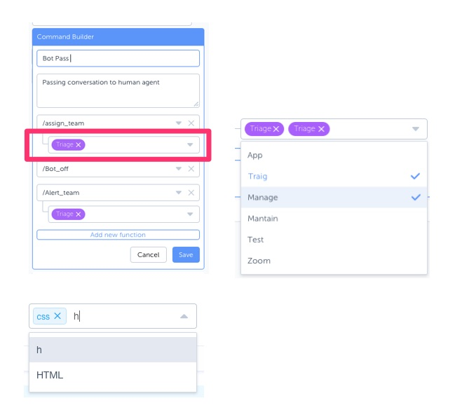

## Assignment
The goal of this exercise is to get a good idea of your experience of frontend technologies, how your write code and approach the problem.  Implement the dropdown component, you will be given a mock restful endpoint to populate data with. 

Mock Endpoint
you can use this endpoint or generate it from the command.json file
http://www.mocky.io/v2/59e00fa20f0000d400effa32

## Submission Guidelines
1. Create a fork of this repository and push code to fork
2. Submit by creating a message with a message or review to github user “slaveniq”

## Dropdown has the following features
1. Click on dropdown for options, select an item, a check mark and tag highted will show up in dropdown box (see screenshots)
2. Similarly you can start typing in the dropdown and be able to select options and tag highted will show up in dropdown box

